# SDLC Pipeline

A manual, cache-first GitHub Copilot pipeline for VS Code covering story analysis,
implementation, unit testing with story validation, and bug fixing. It keeps Copilot usage low without lowering quality.

This README is the only human guide; Copilot does not read it.

## How The Pipeline Is Built (one responsibility, one source of truth)
| Piece | Location | Holds |
|---|---|---|
| Skill | `.github/skills/<stage>/SKILL.md` | The complete, authoritative workflow for one stage: input, prerequisites, role boundaries, procedure, outputs, next command. Invoked directly as `/<stage>`; runs as an isolated subagent (`context: fork`) |
| Global instructions | `.github/copilot-instructions.md` | Small universal rules for every chat, including the stage result format |
| Scoped instructions | `.github/instructions/*.instructions.md` | Coding and test rules, loaded only for matching files |
| Context | `.sdlc/context/` | FACTS about this repository |
| `plan.md` | `.sdlc/work/<ID>/` | The plan for one story |
| `work.json` | `.sdlc/work/<ID>/` | Lifecycle state |
| `log.md` | `.sdlc/work/<ID>/` | What actually happened |

Invocation (skill-first; no prompt files or custom agents):

```text
Developer invokes skill (/analyze-story, /implement-story, ...)
        |
skill runs as an isolated subagent (context: fork)
        |
writes the required .sdlc artifacts / code changes
        |
returns a concise stage result
        |
STOP
        |
human reviews and invokes the next skill
```

The parent chat only starts the invoked skill and relays its result. No skill invokes another skill
or a custom agent, and no stage is chained automatically. Each skill starts from a fresh context,
so cross-stage state comes only from `.sdlc/` artifacts, never from earlier chat history. Skills set
`disable-model-invocation: true`, so they run only when the developer types the command.

## Commands (Copilot Chat)
| Command (skill) | Responsibility |
|---|---|
| `/setup-repo-context <1\|2>` | Builds repository context once (read-only: discovers commands without running builds or tests), makes instructions project-specific |
| `/refresh-repo-context` | Refreshes only context whose source files changed (structure, standards, commands) |
| `/analyze-story <ID> <story text> [deep]` | Understands the story and writes ONE complete `plan.md`. No code, builds, or tests |
| `/implement-story <ID> [approved]` | Executes ONLY the Implementation Plan: creates and edits approved production files. No build, tests, lint, coverage, or validation |
| `/unit-testing <ID>` | Executes the Validation Plan, Unit Test Plan, and AC-to-Validation Mapping: build and type check, unit and component tests, regression, existing integration suite, lint, AC validation, coverage. Routes failures: test issue fixed here, production defect to `/fix-bugs`, plan issue to `/analyze-story`. Never changes production code |
| `/fix-bugs <ID>` | Corrects production defects, each proven by a failing-then-passing regression test with a root-cause note, then recommends `/unit-testing`. Never sets COMPLETE |

Every stage stops after its result. The `NEXT RECOMMENDED COMMAND` is only a recommendation; the
developer reviews the artifacts and invokes the next skill.

## Flow

```mermaid
flowchart TD
  Setup["/setup-repo-context"] --> Analyze["/analyze-story"]
  Setup -. only when cached context is stale .-> Refresh["/refresh-repo-context"]
  Analyze --> Plan["plan.md (DRAFT)"]
  Plan --> Review(["Developer reviews and approves"])
  Review --> Impl["/implement-story: Implementation Plan only"]
  Impl --> Test["/unit-testing: unit tests + AC validation"]
  Test -->|PASS| Done(["COMPLETE"])
  Test -->|production defect| Fix["/fix-bugs"]
  Fix -->|BUG_FIXED| Test
  Test -.->|plan issue| Analyze
```



## Story Status (`work.json` `status`)
```
ANALYSIS_DRAFT -> ANALYSIS_APPROVED -> IMPLEMENTATION_IN_PROGRESS -> IMPLEMENTATION_COMPLETE
  -> UNIT_TESTING_IN_PROGRESS -> COMPLETE
Bug loop: UNIT_TESTING_IN_PROGRESS -> BUG_FOUND -> BUG_FIX_IN_PROGRESS -> BUG_FIXED
  -> UNIT_TESTING_IN_PROGRESS -> COMPLETE
```
| Stage | Runs when status is | Leaves status at |
|---|---|---|
| `/analyze-story` | any (re-analysis resets the plan) | `ANALYSIS_DRAFT` |
| `/implement-story` | `ANALYSIS_DRAFT` or `ANALYSIS_APPROVED`, with `plan.md` approved | `IMPLEMENTATION_COMPLETE` |
| `/unit-testing` | `IMPLEMENTATION_COMPLETE`, `BUG_FIXED`, or `COMPLETE` (re-validation) | `COMPLETE`, `BUG_FOUND`, or unchanged with `waiting_for_human` (plan issue, environment, unresolved test issue) |
| `/fix-bugs` | `BUG_FOUND`, or new defects given in the message | `BUG_FIXED` (or `BUG_FOUND` if some need the developer) |

When a stage stops for the developer (a major deviation, a blocking question, a defect needing
information), the reason is in `work.json` `waiting_for_human` and the status stays where it was.

## Repository Modes
`/setup-repo-context` takes the mode as its argument (`1` = **New Repository** / `GREENFIELD`,
`2` = **Existing Repository** / `EXISTING`); without it, the skill stops and returns the mode
question so the developer can re-invoke it with the answer. The mode is stored as `repositoryMode`
in `.sdlc/context/manifest.json`; no later stage asks again.

| | Existing Repository | New Repository (greenfield) |
|---|---|---|
| Setup reads | the real codebase, `standards/` | the requirement document (required), `standards/`, developer decisions |
| Context | discovered architecture, patterns, commands | `[REQ]` / `[STD]` / `[DEV]` facts, `[PROPOSED]` items, `NOT_ESTABLISHED` patterns, `NOT_CONFIGURED` commands, Open Decisions |
| `plan.md` | existing files to modify, example files to reuse | Files to Create marked `TO_CREATE` / `PROPOSED`; Reuse `NOT_ESTABLISHED`; open decisions block approval |
| Implementation | edits and creates planned files | creates the approved initial files |
| Validation | commands discovered by setup, verified on first use | standard commands for the new project files |

Greenfield flow: `/setup-repo-context 1 <requirement document>` -> `/analyze-story`
-> approve -> `/implement-story` -> `/unit-testing` -> `/refresh-repo-context` once real code exists,
which discovers the actual patterns and commands and moves `contextMaturity` from `INITIAL` to
`ESTABLISHED` (the mode stays `GREENFIELD`).

## Typical Story
1. Run `/analyze-story` with the story ID followed by the story text, for example:
   ```
   /analyze-story PROJ-123
   Title: Login with email
   Description: Users sign in with email and password.
   Acceptance criteria:
   - Valid credentials log the user in.
   - Invalid credentials show an error.
   - Successful login opens the dashboard.
   ```
   Add `deep` for risky or complex stories. The story is read once; its acceptance criteria are
   stored as AC1, AC2, ... in `plan.md`, and no later stage needs the text again.
2. Review `.sdlc/work/PROJ-123/plan.md` and answer any open questions.
3. Approve: set `Status: APPROVED` in `plan.md`, or run `/implement-story PROJ-123 approved`.
4. Review the implementation, then run `/unit-testing PROJ-123`.
5. If validation finds a production defect: run `/fix-bugs PROJ-123`, review, then
   `/unit-testing PROJ-123`. Repeat until `Story Validation: PASS`.
   If validation reports a plan issue (for example an AC that contradicts the Contracts), re-run
   `/analyze-story PROJ-123` with the story text, approve the updated plan, and continue from
   `/implement-story`.

Other uses:
- A bug outside a story: `/fix-bugs BUG-45 Login returns 500 for empty password` (several defects or
  pasted QA/review comments can go in one message), then `/unit-testing BUG-45`.
- Tests for existing code with no story: `/unit-testing src/Services/LoginService.cs`.

## plan.md: One Plan, Stage-Owned Sections
| Section | Executed by |
|---|---|
| Story Summary, Acceptance Criteria, In/Out of Scope, Do Not Modify, Impacted Files, Reuse / Existing Patterns, Dependencies / Risks, Open Questions | Context for all stages |
| Implementation Plan: Contracts, Behavior Rules, Steps (with wiring) | Steps executed by `/implement-story` only; Contracts and Behavior Rules are also the expected results for `/unit-testing` |
| Validation Plan (build and type check, lint, regression, integration, coverage), Unit Test Plan (unit tests only), AC-to-Validation Mapping (each AC with its validation type) | `/unit-testing` only |
| Approval Status | Developer (or `/implement-story` when the developer approves in the message) |

## Work Files (`.sdlc/work/<ID>/`)
| File | Written | Contains |
|---|---|---|
| `plan.md` | stories only; written by `/analyze-story` | The complete story plan (sections above) |
| `work.json` | updated by every stage | Status, waiting-for-human reason, files actually changed, commands with working directories, standards, defects and outcomes |
| `log.md` | appended by every stage | One entry per stage: implementation record, validation results and AC results, defect fixes |

## Repository Context (`.sdlc/context/`)
Built by `/setup-repo-context`, refreshed by `/refresh-repo-context`:
A map of the repository, not a copy. Each fact has one home:
- `project-profile.md`: the repository map. Overview, technology stack, repository structure,
  architecture and flow, modules, pattern examples, testing context, configuration (names only, no
  secrets), a context-policy summary, key documents. The developer maintains sections 10-13 (Domain
  Glossary, Known Pitfalls, Story Conventions, Shared Files); refresh never overwrites them.
- `standards-summary.md`: the condensed, actionable coding rules for this repository (observed
  project conventions plus condensed company standards), by area. The path-specific instruction
  files point to its sections instead of repeating rules.
- `manifest.json`: build and test commands (working directory, command, narrow variant, status:
  `NOT_RUN (unverified)` after setup, `VERIFIED` once `/unit-testing` has used them and
  `/refresh-repo-context` has cached the result); the
  `contextPolicy`, which classifies this repository's paths by purpose into `normalPaths`,
  `readWhenRelevant`, `skipByDefault`, and `doNotModify` (stages search `normalPaths` by default and
  never change `doNotModify` without approval); the git
  commit the context was built from, and which repository paths each section came from.
  `/refresh-repo-context` runs `git diff` from that commit and refreshes only what changed.

Stages read these only for facts missing from `plan.md` and `work.json`.

## Instruction Files (`.github/`)
- `skills/<stage>/SKILL.md`: the six stage skills, each the complete workflow for its command (see the table above)
- `copilot-instructions.md`: short, loaded in every chat; project summary and universal rules
- `instructions/backend`, `frontend`, `data` `.instructions.md`: loaded only for matching paths (`applyTo`); each points to the relevant sections of `standards-summary.md`
- `instructions/tests.instructions.md`: loaded only for test files; the test guardrails (never game tests)
- `standards/`: the full company standards, kept as the human reference
- `instructions/sdlc-artifacts.instructions.md`: loaded only for `.sdlc/**`; says which file owns which fact

## First-Time Setup In A Client Repository
1. Copy `.github/` (skills, instructions, `copilot-instructions.md`), `.sdlc/`, and `standards/` into
   the repository root. Agent Skills must be enabled in your VS Code / Copilot version; check that
   the six SDLC skills appear in the `/` menu (Chat > Configure Skills, or your version's equivalent).
2. Each `SKILL.md` declares `context: fork` so it runs as an isolated subagent. No prompt files or
   custom agents are needed.
3. Optional: pin a model per skill by adding `model: <name>` to its frontmatter, using a name
   exactly as shown in your Copilot model picker. Without it, the model selected in chat is used.
4. Run `/setup-repo-context 2` (existing repository) or `/setup-repo-context 1 <requirement document>` (new repository). Review `.sdlc/context/project-profile.md`, `standards-summary.md`,
   and the command statuses in `manifest.json`. Fill in sections 10-13 of `project-profile.md`
   (Domain Glossary, Known Pitfalls, Story Conventions, and Shared Files if several developers share
   the repository).
5. Pipeline work files are ignored by `.sdlc/.gitignore` (edit it to commit `plan.md` files instead).
   Commit `.sdlc/context/` so the whole team shares it.

## When To Refresh Or Re-Analyze
- Run `/refresh-repo-context` when folder structure, standards, documentation, or build and test
  commands change.
- Re-run `/analyze-story` for a story when its acceptance criteria change (paste the updated story text), or when the code it
  depends on changed enough to make the plan wrong.
- Stale plans are detected automatically: `/analyze-story` saves the Git revision in `work.json`
  (`analyzed_at_commit`). Before touching code, `/implement-story` checks whether any file in the
  plan's Impacted Files was changed in a commit since then. If so, it stops and lists the files;
  re-run `/analyze-story <ID>` with the story text, or run `/implement-story <ID> continue` to keep
  the current plan. Only committed changes count, so your own uncommitted edits never trigger it.
