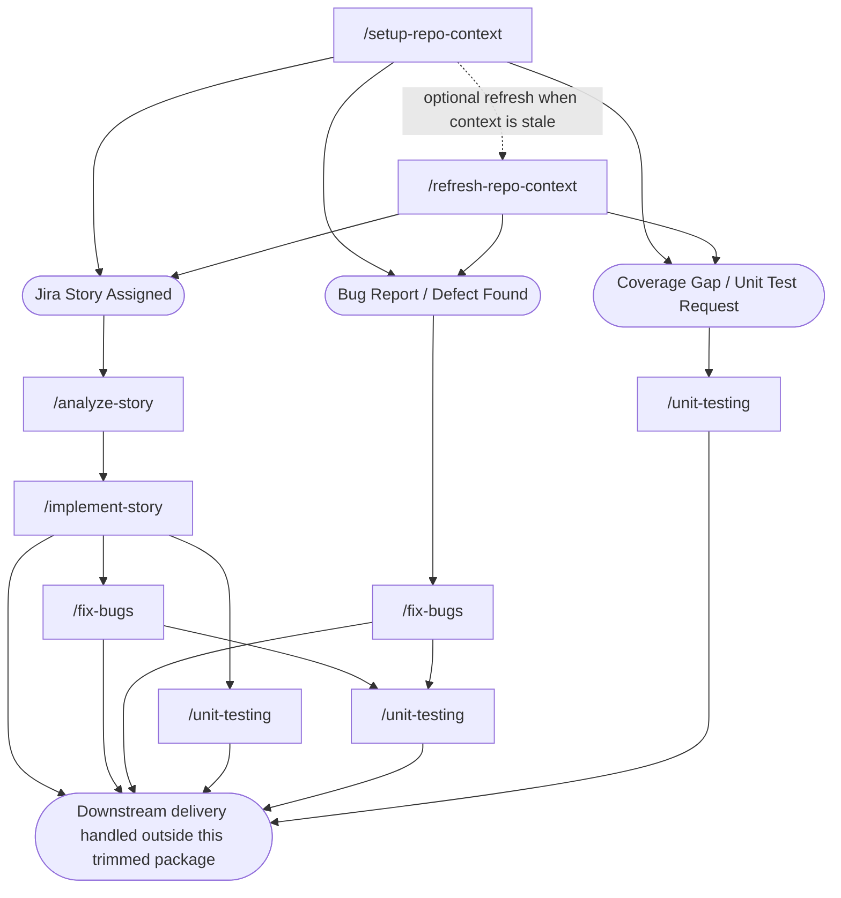

# Pipeline Flow Diagram

> Companion visual to [workflow.md](workflow.md). Keep this diagram in sync if the retained
> stage sequence changes.

## Legend
- **Rounded box** = a manually invoked slash command (never auto-triggered).
- **Stadium (pill) shape** = a human-only action (never performed by Copilot).

## Overall Flow

## Notes

- `/refresh-repo-context` is optional after `/setup-repo-context`; run it when repository context becomes
  stale or when standards, structure, or build guidance changes.
- `/analyze-story` creates the story artifacts consumed by `/implement-story`.
- `/fix-bugs` can run standalone for existing code or attach to the current story when the
  defect is part of in-progress story work.
- `/unit-testing` creates or updates unit tests, then runs the narrowest unit-test and
  scoped coverage commands for the requested slice.
- Broader downstream testing beyond this focused unit-test stage, plus PR, review, merge, and
  QA, are intentionally outside this repository's current scope.

No command in this pipeline ever calls the next one automatically — every box above is a
manual, human-triggered step, and the final handoff remains outside Copilot automation.
